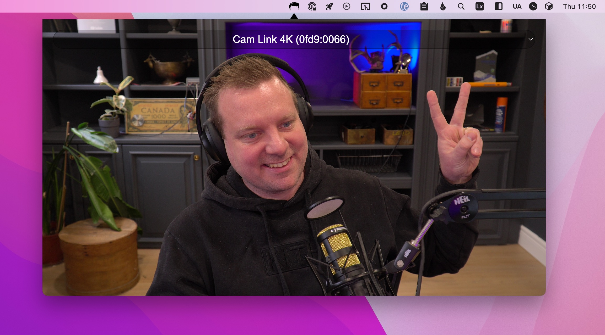

## Pommade

A little app to check your hair. Built with Electron.

## Running

1. `npm install`
2. `npm start`

## Features I'd like
1. Make it work with vite - restarting the app sucks.
1. Package it as an actual app

## Issues
When you start it, it absolutely pukes stuff into the node console. Not sure why or what that is.

